# Sistema de Gestão Escolar

## Sistema para gerenciar funcionarios, alunos, cursos e matrículas

1. Quem utilizará o sistema (usuários)?
    - Funcionários

2. Quais os tipos de usuários e o que cada tipo consegue fazer?
       - Colaboradores: Cadastrar alunos, cadastrar cursos, editar dados dos alunos,
    editar dados dos cursos, excluir alunos, excluir cursos, listar alunos, listar cursos,
    matricular alunos nos cursos, desmatricular alunos dos cursos e atualizar os próprios dados.
       - Admin: Todas as funções acima, mais: cadastrar outros funcionários, listar outros funcionários,
    editar dados dos outros funcionários e excluir outros funcionários.

3. Quais informações iremos armazenar?
       - Funcionários: Nome, email, cargo, data de nascimento, cpf, senha,
    telefone, endereço.
       - Alunos: Matrícula, cpf, nome, data de nascimento, email, telefone, endereço.
       - Cursos: Descrição, carga horária, nome.
       - Matrículas: Quais alunos estão cadastrados em quais cursos

4. Quais regras ou restrições são necessárias?
       - Apenas funcionários admin podem criar/deletar outros funcionários.
       - Funcionários colaboradores não podem editar dados de outros funcionários.
       - CPF não pode repetir, email não pode repetir.
       - Nome, email, cargo, CPF, senha, carga horária, matrícula são dados obrigatórios.
       - Um aluno não pode ser matriculado 2 ou mais vezes no mesmo curso.
       - O sistema deve validar as informações.

## PROBLEMA:
 - Esse sistema é direcionado a funcionários de escolas
 - Permite cadastrar, editar, listar e deletar alunos, cursos, matrículas e funcionários

## MODELO DE NEGÓCIO:
  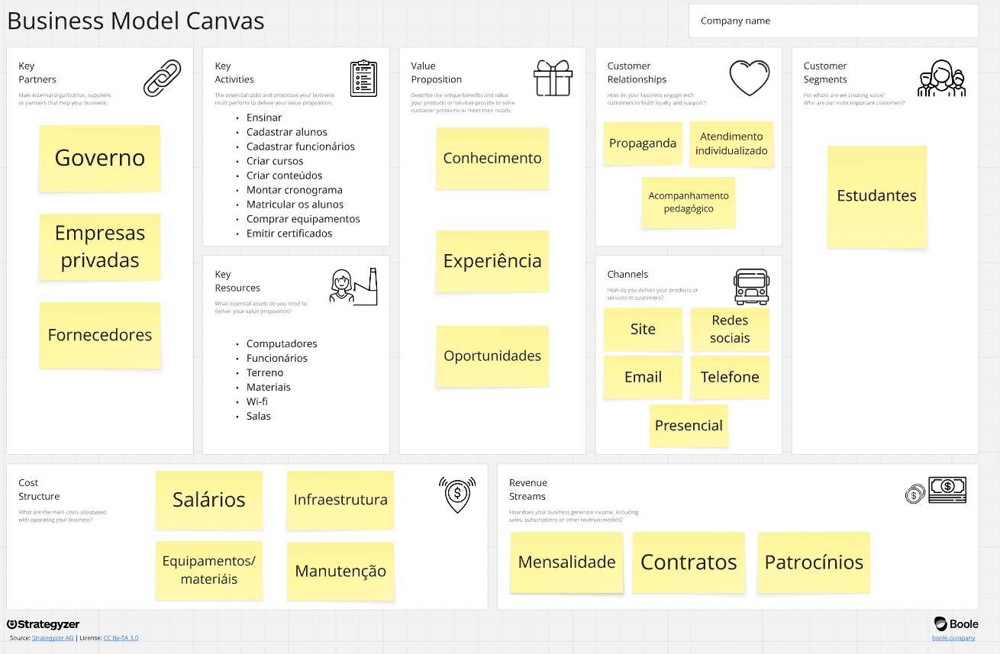

## REQUISITOS:
1. Requisitos Funcionais:
  - Cadastrar alunos
  - Cadastrar funcionários
  - Cadastrar cursos
  - Listar alunos
  - Listar cursos
  - Listar funcionários
  - Mostrar os dados do aluno
  - Mostrar os dados dos funcionários
  - Mostrar os dados do curso
  - Realizar as matículas
  - Editar os dados do aluno
  - Editar os dados do funcionário
  - Editar os dados do curso
  - Excluir os alunos
  - Excluir os funcionários
  - Excluir os cursos
  - Excluir as matrículas
  - Login de usuários
  - Buscar aluno pelo nome
  - Buscar aluno pelo CPF
  - Buscar funcionário pelo nome
  - Buscar funcionário pelo CPF
  - Mostrar os cursos em que cada aluno está matriculado
  - Mostrar os alunos que estão matriculados em cada curso

2. Requisitos não Funcionais:
  - Autenticação
  - Interface com navegação padronizada e consistente entre as telas
  - Interface responsiva e adaptativa à diversas resoluções de tela e dispositivos diferentes, como computador, celular e tablet
  - Interface deve ser compatível com os principais navegadores web
  - Criptografar as senhas antes de salvá-las no banco de dados
  - Disponível durante todo o horário de funcionamento da instituição
  - Restringir acesso pelo tipo de usuário

## REGRAS DE NEGÓCIO:
- CPF de cada aluno deve ser único
- CPF de cada funcionário deve ser único
- Email de cada funcionário deve ser único
- A matrícula de cada aluno deve ser única
- Nome de cada curso deve ser único
- Impedir exclusão de cursos que tenham alunos matriculados
- Impedir exclusão de alunos que estejam matriculados em 1 ou mais cursos

## CASO DE USO:
  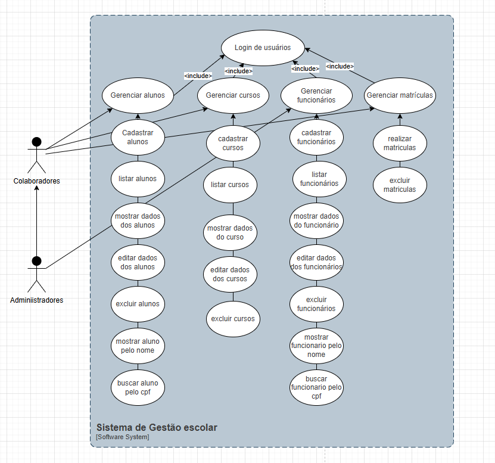

## Classes:
  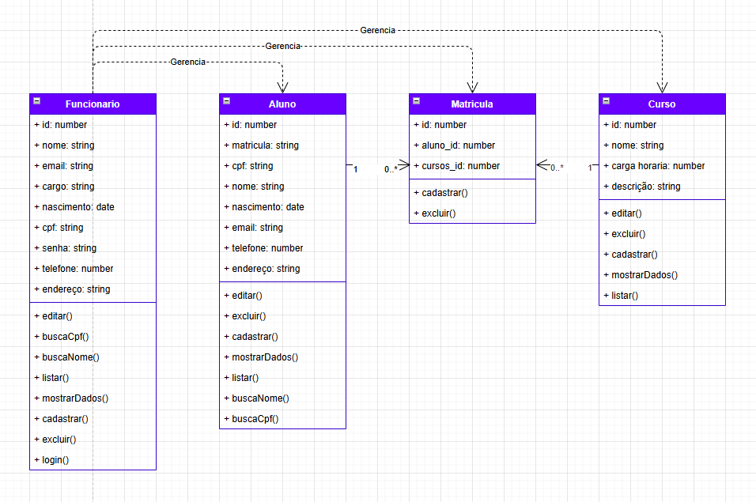

## Sequências:
  Login:
  
  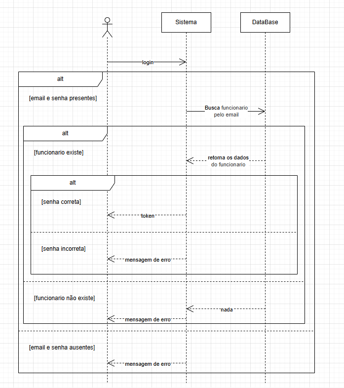

  Cadastro funcionário:

  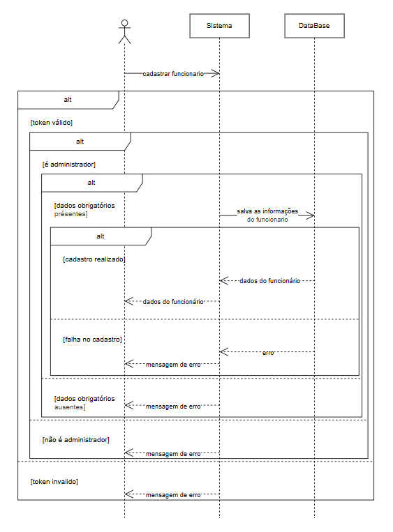

  Cadastro aluno:

  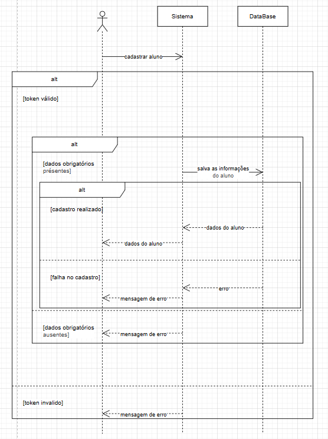

  Cadastro curso:

  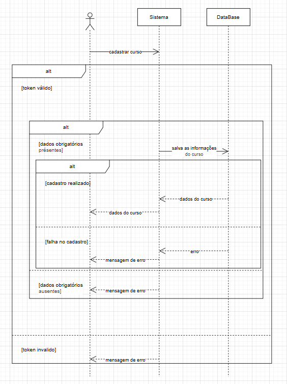

  Lista funcionários:

  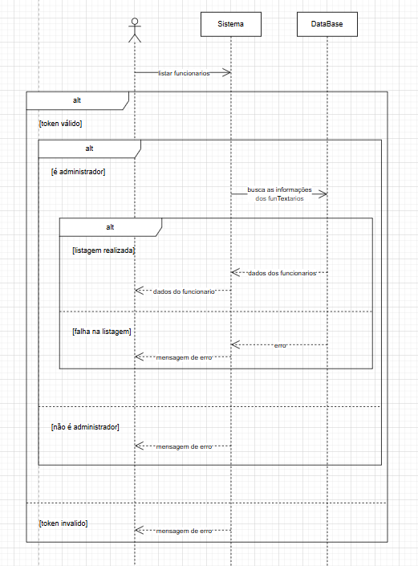

  Lista alunos:

  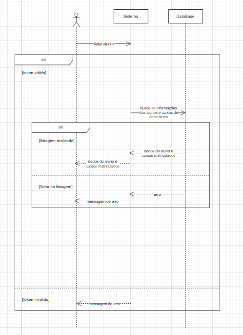

  Lista cursos:

  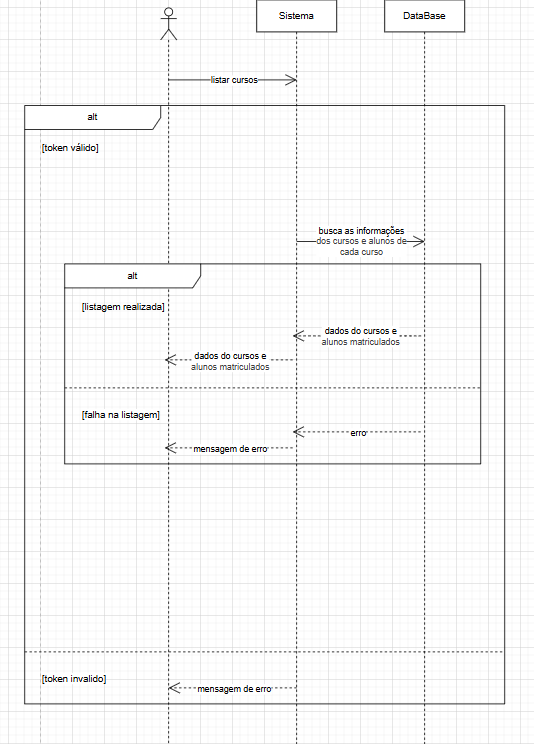

  Mostra dados do aluno:

  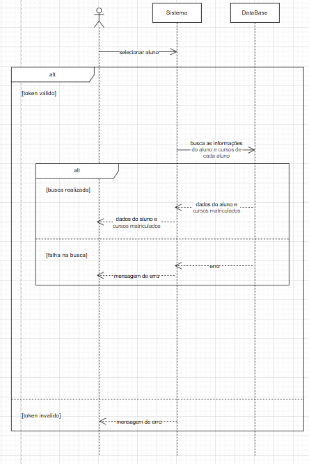

  Mostra dados do curso:

  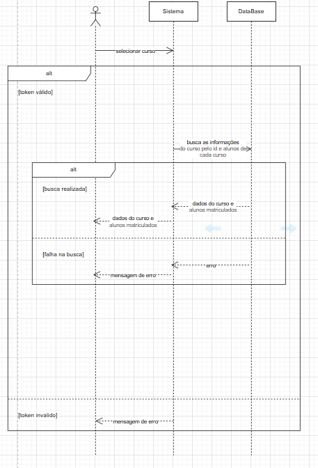

  Mostra dados do funcionario:

  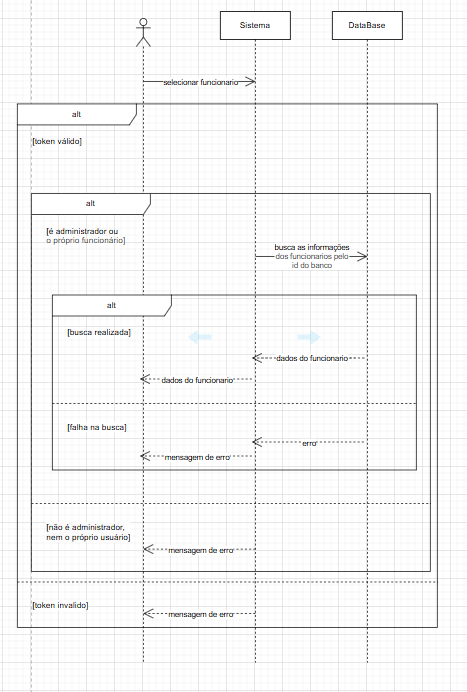

  Editar dados do aluno:

  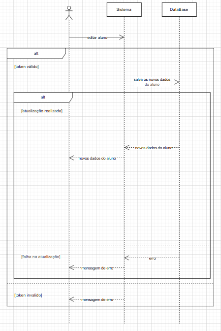

  Editar dados do curso:

  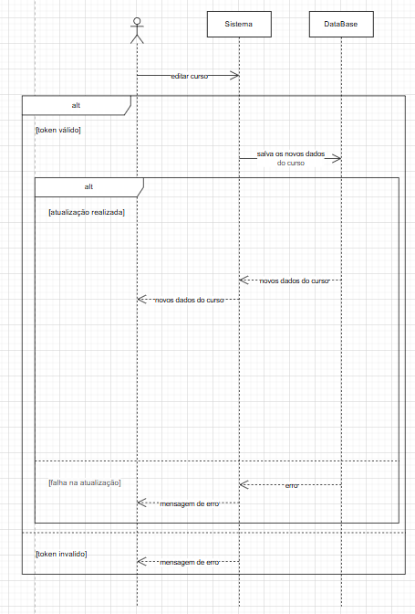

  Editar dados do funcionario:

  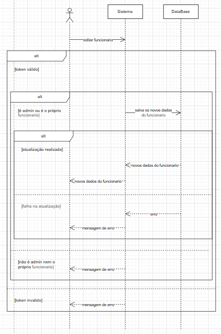

  Excluir alunos:

  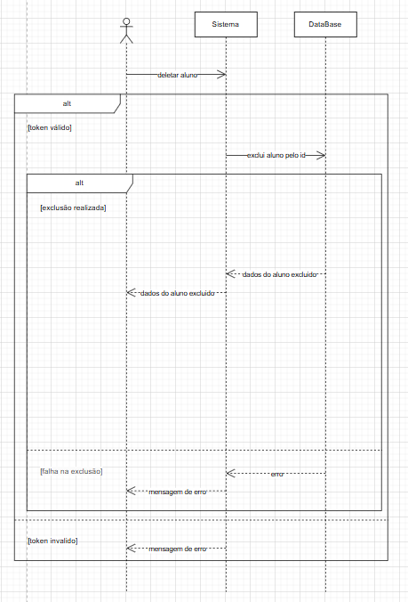

  Excluir cursos:

  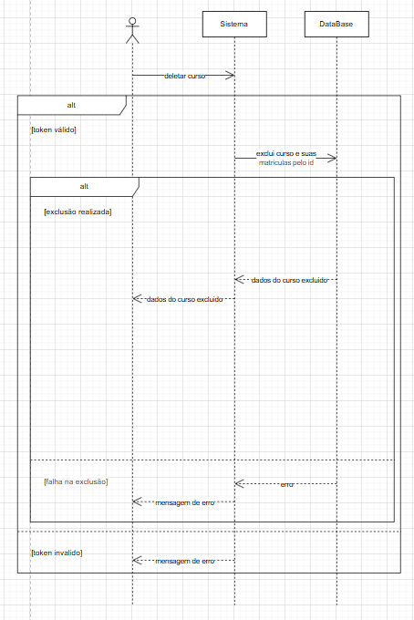

  Excluir funcionarios:

  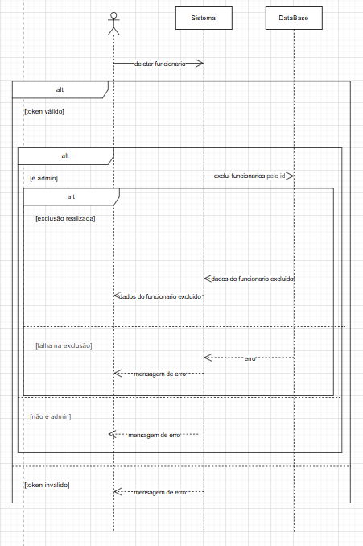

  Busca alunos pelo nome:

  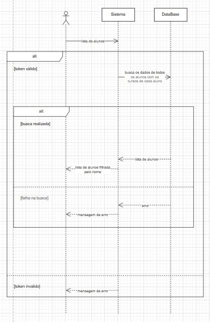

  Busca alunos pelo CPF:

  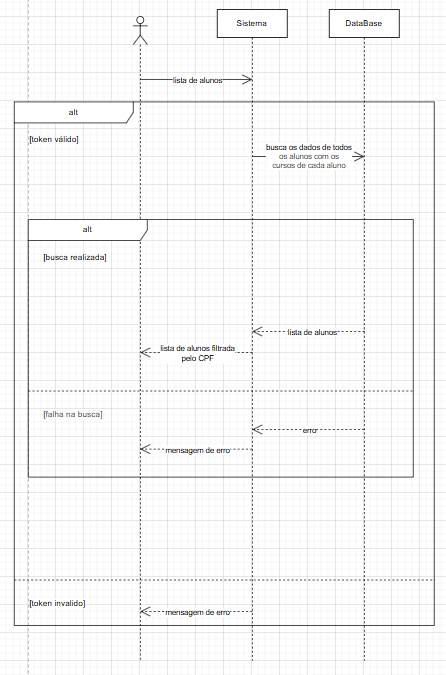

  Busca funcionario pelo nome:

  

  Busca funcionario pelo CPF:

  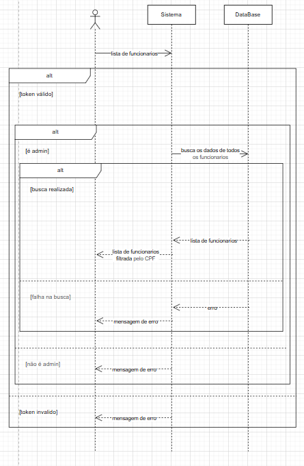

  Realizar matriculas:

  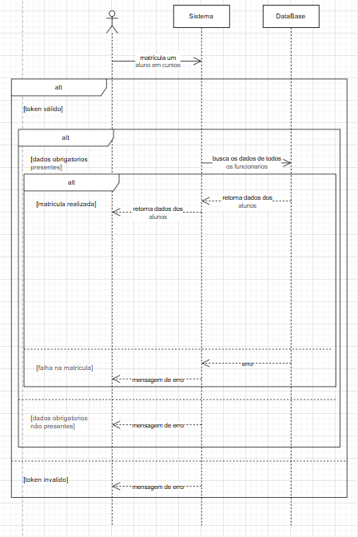

  excluir matriculas:

  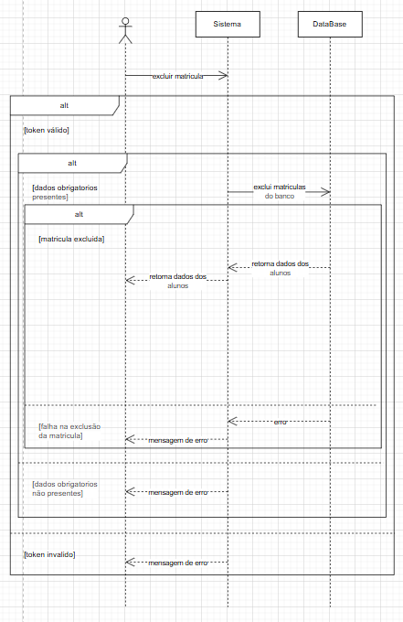

  ## UX/UI:

  [Acesse o Figma](https://www.figma.com/design/gF56bLTmuWnt73KCzqD05p/Sistema-de-Gest%25C3%25A3o-Escolar?node-id=0-1&p=f&t=3VMEmH4Ok2xmzGTM-0)